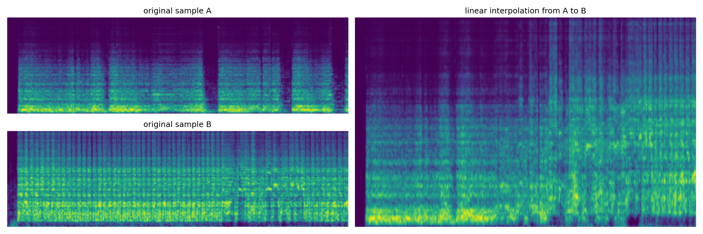
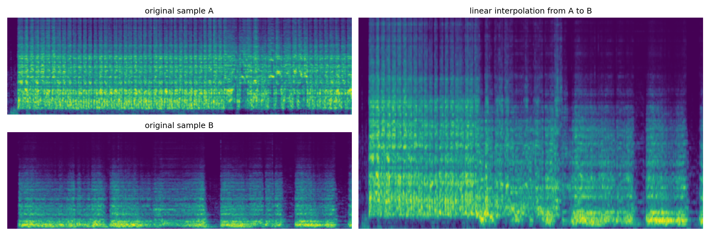
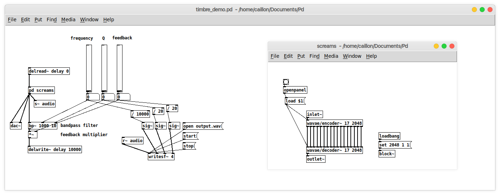

In this section, we present several results from the continous latent model performing various tasks like style transfer, latent interpolation, and integration within two framework (offline and realtime).

## Offline interface

We provide a graphical interface in order to ease the process of using deep learning models for general audio manipulation. 

  

This interface expose the latent path infered by the model from a input audio sample. Several mathematical operators are available to scale, randomize, bias or reverse the latent path, as well as a curve editing window, allowing direct modification of each dimension. We also provide an interpolation pseudo-plane, allowing a weighted linear interpolation between four latent paths. The following examples have been generated using this interface.

### Interpolation

Here we show how the continuous model can perform a linear interpolation between two input audio samples. Both samples are first encoded into a latent path z_a and z_b of size N, then we compute an *interpolated* path:

z[n] = z_a[n] * (1 - n/N) + z_b * (n/N)

The following examples show the melspectrogram corresponding to the original samples and the interpolated ones. The audio examples will play in order sample A, sample B and the interpolation.

---

**Dataset**: Strings

  

<audio controls src="Audio_Exemple/wavae_strings/AtoB.wav"></audio>

---

**Dataset**: Strings

  

<audio controls src="Audio_Exemple/wavae_strings/BtoA.wav"></audio>

---

&nbsp;

### Style transfer

By giving a model an input sample that is out of the domain on which it has been trained, we can get some sort of style transfer:

  

&nbsp;

| Domain    | Audio                                                                      |
| :-------: | :------------------------------------------------------------------------: |
| Original  | <audio controls src="Audio_Exemple/wavae_style_transfer/cutecat.wav">      |
| Strings   | <audio controls src="Audio_Exemple/wavae_style_transfer/cat_alex.wav">     |
| Screams   | <audio controls src="Audio_Exemple/wavae_style_transfer/cat_scream.wav">   |
| Singing   | <audio controls src="Audio_Exemple/wavae_style_transfer/cat_vocalset.wav"> |
| Spoken    | <audio controls src="Audio_Exemple/wavae_style_transfer/cat_voice.wav">    |

&nbsp;

## Realtime interface

### Feedback shaping

Using our realtime puredata implementation, we can easily feed the model with its own output, filtered with a bandpass filter defined by its center frequency f and quality factor Q, as described in the figure below.

  

This gives a way to shape the model's generation based on a user-defined spectral shape. The puredata patch used to produce the following example is the one below

  

**Dataset**: Screams

  

<audio controls src="Audio_Exemple/wavae_scream_feedback/audio.wav"></audio>

&nbsp;
