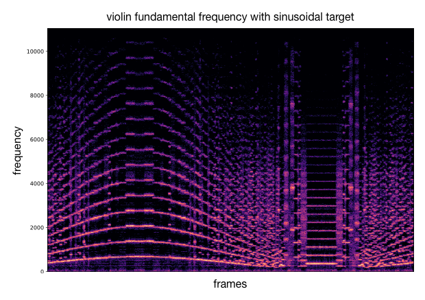
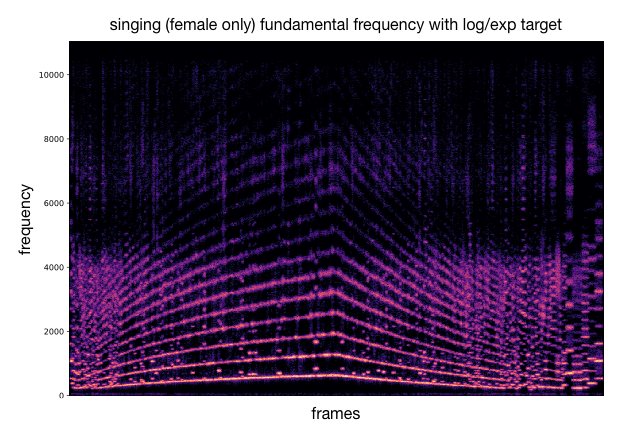
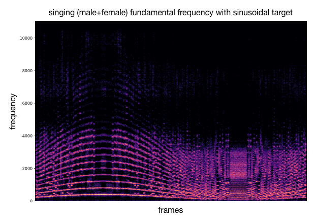

# Discrete latent space analyzed and controlled with target acoustic descriptors

In this section, we give examples from VQ-VAE models for different individual timbre domains. Each model has been trained on a single class e.g. violin recordings or singing voices. We can first visualize how the latent codebook embeds the short-term timbre features by scattering in 2D the quantization vectors and coloring with a gradient that accounts to their relative descriptor values. We use the projection of the PCA from the latent dimensionnality to the 2D visualization. We can as well plot the corresponding histogram of acoustic descriptor values to view their distribution in the codebook.

Using the previous analysis, we can draw an acoustic descriptor target and match the closest codebook vectors. These latent codes are decoded into audio that approximately follows the desired variation of acoustic descriptor. Besides the audio samples, we can plot spectrograms to visualize the sound synthesis and as well compute the acoustic descriptor over the generated audio for comparison with the provided target curve. As an example, we either use a target with sinusoidal shape or log/exp shapes.

**visualization and control of a violin model analyzed wrt. centroid**

  

We can see that the codebook embeds a bell shapped distribution of centroid values centred around a value of 2000. The latent projections are partially organized consistenly with this distribution. We see that the color gradient is globally distributed from high values (bottom left to middle in dark grays) to low values (middle right in light grays). Although the local structure is not consistent and the neighborhood of each projection does not relate to the nearest elements in terms of acoustic value. For that reason, we directly order series of latent codes by matching their acoustic descriptor values to a target. When decoding such series, we observe that the audio can approximately follow the desired target.

&nbsp;

  

<audio controls><source src="Audio_Exemple/violin_centroid_sin.wav"></audio>

&nbsp;

  

<audio controls><source src="Audio_Exemple/violin_centroid_exp.wav"></audio>

&nbsp;

**controlling other descriptors and timbre models**

This process can be applied to other timbre models and other acoustic descriptors (as well as different target curves). We provide additional examples of this.

|    |   |
|  :---:  | :---:  |
|  |  |
| <audio controls><source src="Audio_Exemple/violin_fundamental_exp.wav"></audio> | <audio controls><source src="Audio_Exemple/violin_fundamental_sin.wav"></audio> |
|  |  |
| <audio controls><source src="Audio_Exemple/sing_fem_centroid_exp.wav"></audio> | <audio controls><source src="Audio_Exemple/sing_centroid_sin.wav"></audio> |
|  |  |
| <audio controls><source src="Audio_Exemple/sing_fem_fundamental_exp.wav"></audio> | <audio controls><source src="Audio_Exemple/sing_fundamental_sin.wav"></audio> |
|  |  |
| <audio controls><source src="Audio_Exemple/trumpet_bandwidth_exp.wav"></audio> | <audio controls><source src="Audio_Exemple/horn_bandwidth_sin.wav"></audio> |