# Continuous latent space

In this section, we present several results from the continous latent model performing various tasks like style transfer, latent interpolation, and integration within two framework (offline and realtime).

## Offline interface

We provide a graphical interface in order to ease the process of using deep learning models for general audio manipulation. 

 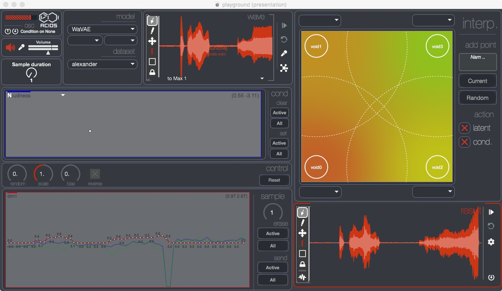 

This interface expose the latent path infered by the model from a input audio sample. Several mathematical operators are available to scale, randomize, bias or reverse the latent path, as well as a curve editing window, allowing direct modification of each dimension. We also provide an interpolation pseudo-plane, allowing a weighted linear interpolation between four latent paths. The following examples have been generated using this interface.

### Interpolation

Here we show how the continuous model can perform a linear interpolation between two input audio samples. Both samples are first encoded into a latent path z_a and z_b of size N, then we compute an *interpolated* path:

z[n] = z_a[n] * (1 - n/N) + z_b * (n/N)

The following examples show the melspectrogram corresponding to the original samples and the interpolated ones. The audio examples will play in order sample A, sample B and the interpolation.

---

**Dataset**: Strings

 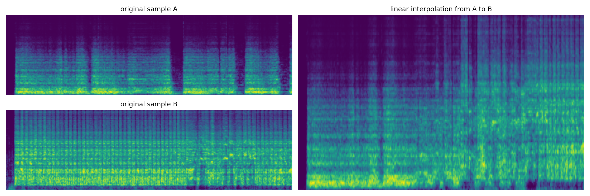 

<audio controls src="Audio_Exemple/wavae_strings/AtoB.wav"></audio>

---

**Dataset**: Strings

 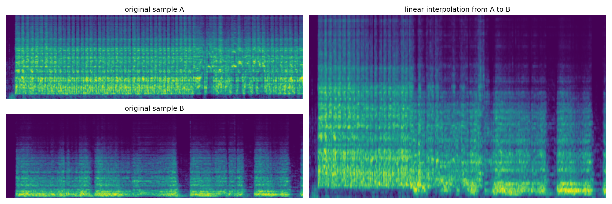 

<audio controls src="Audio_Exemple/wavae_strings/BtoA.wav"></audio>

---

&nbsp;

### Style transfer

By giving a model an input sample that is out of the domain on which it has been trained, we can get some sort of style transfer:

| Domain    | Audio                                                                      |
| --------- | -------------------------------------------------------------------------- |
| Original  | <audio controls src="Audio_Exemple/wavae_style_transfer/cutecat.wav">      |
| Strings   | <audio controls src="Audio_Exemple/wavae_style_transfer/cat_alex.wav">     |
| Screams   | <audio controls src="Audio_Exemple/wavae_style_transfer/cat_scream.wav">   |
| Singing   | <audio controls src="Audio_Exemple/wavae_style_transfer/cat_vocalset.wav"> |
| Spoken    | <audio controls src="Audio_Exemple/wavae_style_transfer/cat_voice.wav">    |

&nbsp;

## Realtime interface

### Feedback shaping

Using our realtime puredata implementation, we can easily feed the model with its own output, filtered with a bandpass filter defined by its center frequency f and quality factor Q, as described in the figure below.

 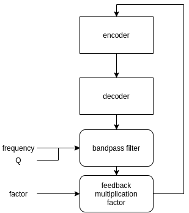 

This gives a way to shape the model's generation based on a user-defined spectral shape. The puredata patch used to produce the following example is the one below

 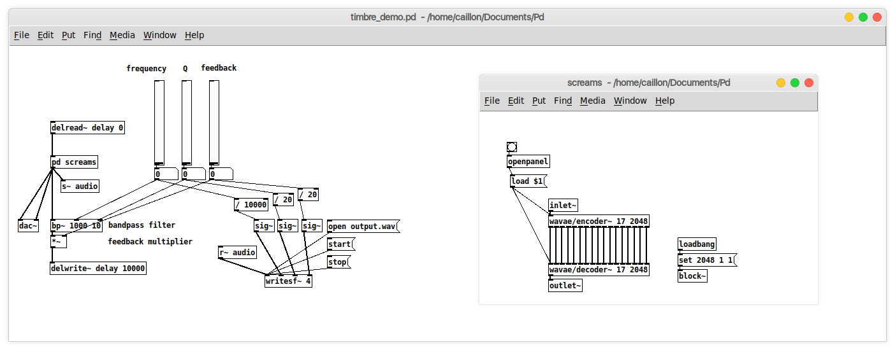 

**Dataset**: Screams

 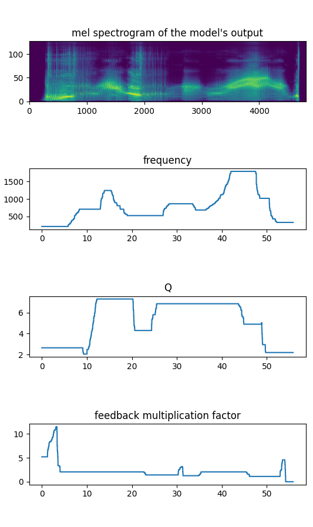 

<audio controls src="Audio_Exemple/wavae_scream_feedback/audio.wav"></audio>

&nbsp;

# Discrete latent space analyzed and controlled with target acoustic descriptors

In this section, we give examples from VQ-VAE models for different individual timbre domains. Each model has been trained on a single class e.g. violin recordings or singing voices. We can first visualize how the latent codebook embeds the short-term timbre features by scattering in 2D the quantization vectors and coloring with a gradient that accounts to their relative descriptor values. We use the projection of the PCA from the latent dimensionnality to the 2D visualization. We can as well plot the corresponding histogram of acoustic descriptor values to view their distribution in the codebook.

Using the previous analysis, we can draw an acoustic descriptor target and match the closest codebook vectors. These latent codes are decoded into audio that approximately follows the desired variation of acoustic descriptor. Besides the audio samples, we can plot spectrograms to visualize the sound synthesis and as well compute the acoustic descriptor over the generated audio for comparison with the provided target curve. As an example, we either use a target with sinusoidal shape or log/exp shapes.

**visualization and control of a violin model analyzed wrt. centroid**

 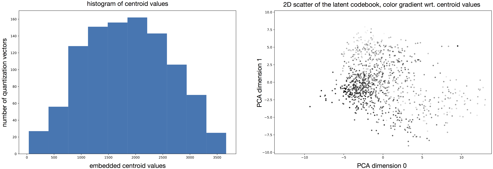 

We can see that the codebook embeds a bell shapped distribution of centroid values centred around a value of 2000. The latent projections are partially organized consistenly with this distribution. We see that the color gradient is globally distributed from high values (bottom left to middle in dark grays) to low values (middle right in light grays). Although the local structure is not consistent and the neighborhood of each projection does not relate to the nearest elements in terms of acoustic value. For that reason, we directly order series of latent codes by matching their acoustic descriptor values to a target. When decoding such series, we observe that the audio can approximately follow the desired target.

&nbsp;

  

<audio controls><source src="Audio_Exemple/violin_centroid_sin.wav"></audio>

&nbsp;

  

<audio controls><source src="Audio_Exemple/violin_centroid_exp.wav"></audio>

&nbsp;

**controlling other descriptors and timbre models**

This process can be applied to other timbre models and other acoustic descriptors (as well as different target curves). We provide additional examples of this.

|    |   |
|  :---:  | :---:  |
| 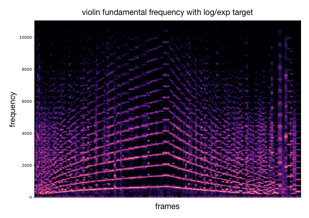 | 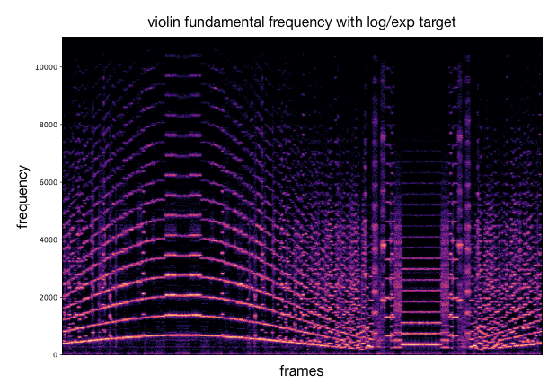 |
| <audio controls><source src="Audio_Exemple/violin_fundamental_exp.wav"></audio> | <audio controls><source src="Audio_Exemple/violin_fundamental_sin.wav"></audio> |
| 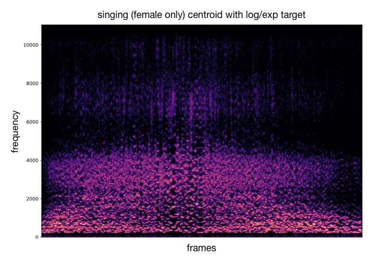 | 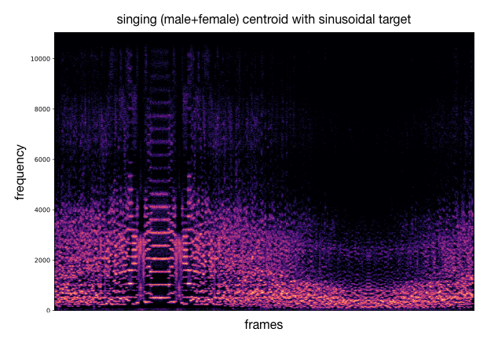 |
| <audio controls><source src="Audio_Exemple/sing_fem_centroid_exp.wav"></audio> | <audio controls><source src="Audio_Exemple/sing_centroid_sin.wav"></audio> |
| 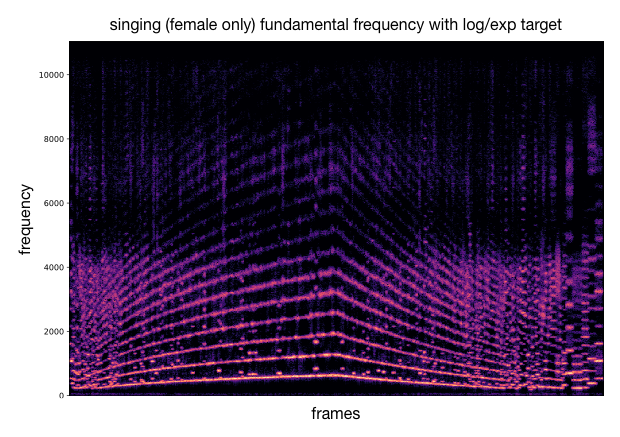 | 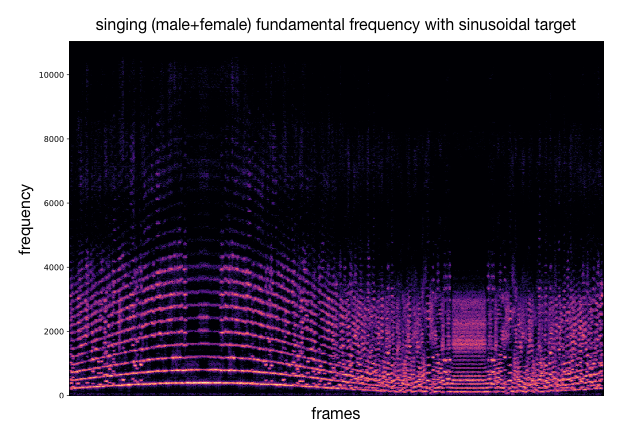 |
| <audio controls><source src="Audio_Exemple/sing_fem_fundamental_exp.wav"></audio> | <audio controls><source src="Audio_Exemple/sing_fundamental_sin.wav"></audio> |
| 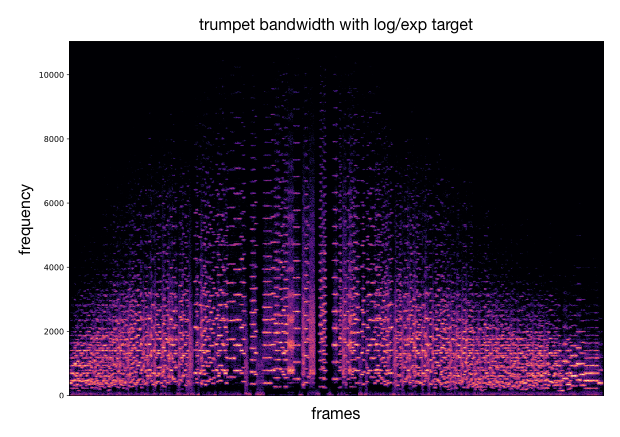 | 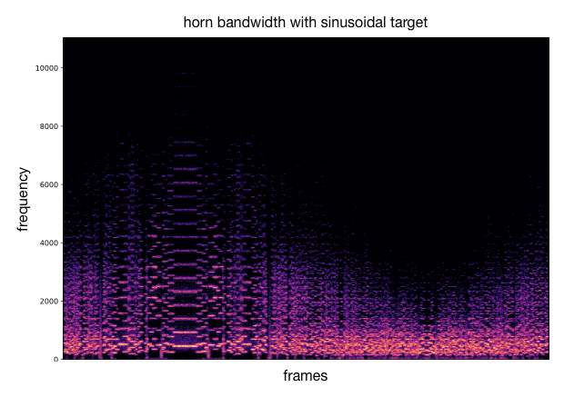 |
| <audio controls><source src="Audio_Exemple/trumpet_bandwidth_exp.wav"></audio> | <audio controls><source src="Audio_Exemple/horn_bandwidth_sin.wav"></audio> |

&nbsp;

&nbsp;

## References

 1. **[Engel et al., 2017]** Neural Audio Synthesis of Musical Notes with WaveNet Autoencoders. International Conference on Machine Learning, 2017.
 2. **[Kingma and Welling, 2014]** Auto-Encoding Variational Bayes. International Conference on Learning Representations, 2014.
 3. **[Higgins et al., 2017]** beta-vae: Learning basic visual concepts with a constrained variational framework. International Conference on Learning Representations, 2017.
 4. **[Esling et al., 2018]** Generative timbre spaces with variational audio synthesis. In Proceedings of the International Conference on Digital Audio Effects, 2018.
 5. **[Bitton et al., 2019]** Assisted Sound Sample Generation with Musical Conditioning in Adversarial Auto-Encoders. In Proceedings of the International Conference on Digital Audio Effects, 2019.
 6. **[Oord et al., 2018]** Neural Discrete Representation Learning. In Advances in Neural Information Processing Systems, pages 6306–6315, 2017.
